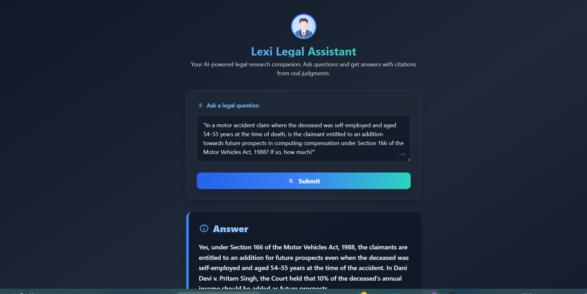

# Lexisg-frontend-intern-test

## How to run the project

1. Clone the repo:
   ```
   git clone https://github.com/RajSingh0210/Lexisg-frontend-intern-test.git
   cd Lexisg-frontend-intern-test
   ```
2. Install dependencies:
   ```
   npm install
   ```
3. Start the dev server:
   ```
   npm start
   ```
   or
   ```
   npm run dev
   ```

## Screenshot



## Citation Linking

Each answer includes a citation section. The citation provides:
- A direct link to the source PDF.
- The paragraph number to reference.
- Highlighted text for context.

## Hosted Link

[Live Demo on Netlify](https://your-app-name.netlify.app/)
